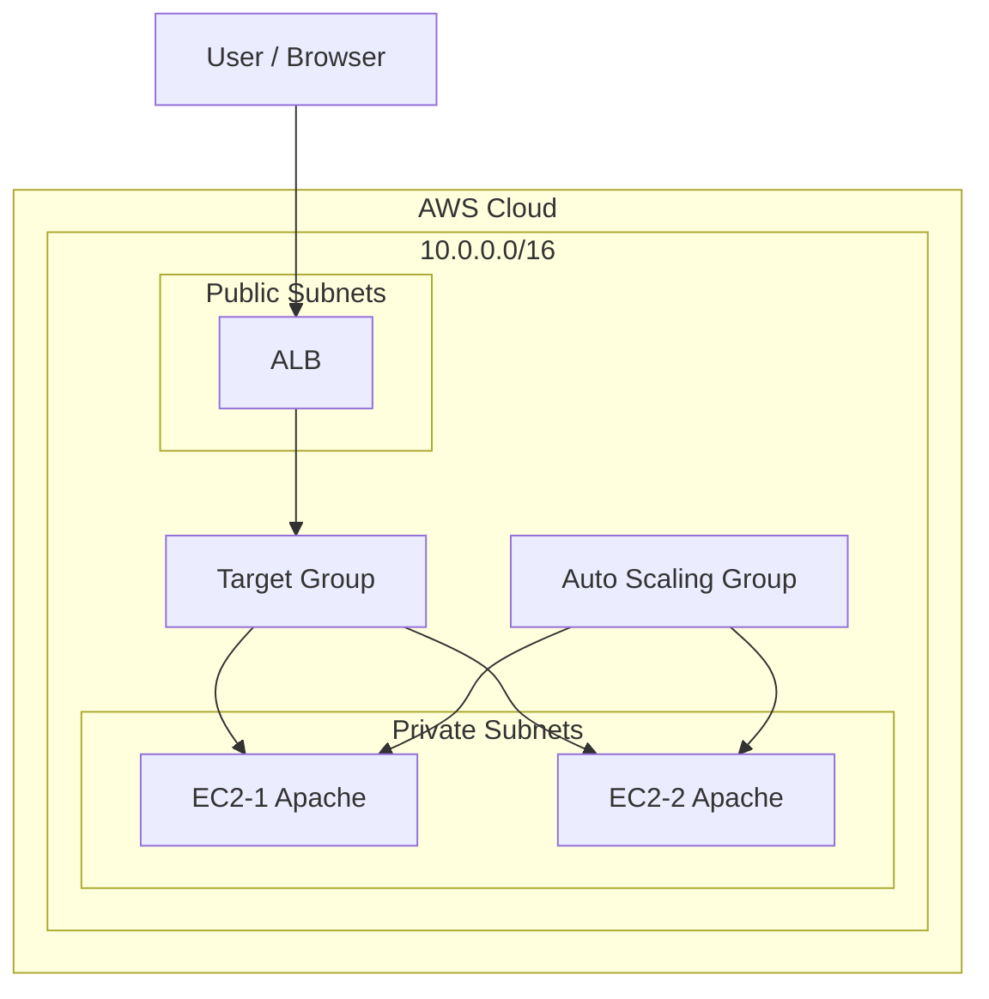

# Day29 Auto Scaling（自動スケーリング）

## 環境
・AWS  
・VPC（10.0.0.0/16）  
・Publicサブネット ×2（異なるAZ）  
・Privateサブネット ×2（異なるAZ）  
・Internet Gateway  
・NAT Gateway  
・ALB  
・EC2（Amazon Linux 2）  
・Auto Scaling Group  

---

## 概要
Auto Scalingを利用し、CPU使用率に応じてEC2インスタンスが自動で増減する構成を構築する。  
ALBと連携することで、スケーリングされたインスタンスへトラフィックが分散されることを確認する。

---

## 作業手順

### 1. AMI作成
既存のEC2インスタンスからAMIを作成  

---

### 2. 起動テンプレート作成
・AMI：作成したAMI  
・インスタンスタイプ：t3.micro  
・セキュリティグループ：HTTP許可  
・サブネットは未指定  

---

### 3. Auto Scaling Group作成
・起動テンプレートを指定  
・VPC：対象VPC  
・サブネット：Privateサブネットを2つ（異なるAZ）  

---

### 4. キャパシティ設定
・最小：1  
・最大：3  
・希望：1  

---

### 5. ALBと連携
・既存のターゲットグループを指定  

---

### 6. スケーリングポリシー設定
・タイプ：ターゲット追跡  
・CPU使用率：50%  

---

### 7. スケールアウト確認
以下コマンドでCPU負荷を上げる  

yes > /dev/null  

EC2インスタンスが自動で増加することを確認  

---

### 8. スケールイン確認
負荷停止  

pkill yes  

最小キャパシティおよび希望キャパシティを0に変更し、  
インスタンスが自動で削除されることを確認  

---

## 確認

・CPU負荷上昇によりEC2が増加すること  
・ALBに新しいインスタンスが登録されること  
・負荷低下によりEC2が削除されること  
・Desired容量の変更によりインスタンス数が制御されること  

---

## 補足

・起動テンプレートではインスタンス構成のみを定義し、サブネットはAuto Scaling側で指定する  
・Auto Scalingはグループ全体のCPU使用率を基準にスケーリングを行う  
・スケールインは即時ではなく、一定時間後に実行される  

---

## 学び

・Auto Scalingの仕組み（スケールアウト / スケールイン）を理解  
・ALBと連携したスケーリング構成を理解  
・最小・最大・希望キャパシティの役割を理解  
・実務に近い可用性・スケーラビリティを考慮した構成を構築できた  

---

## 構成図

